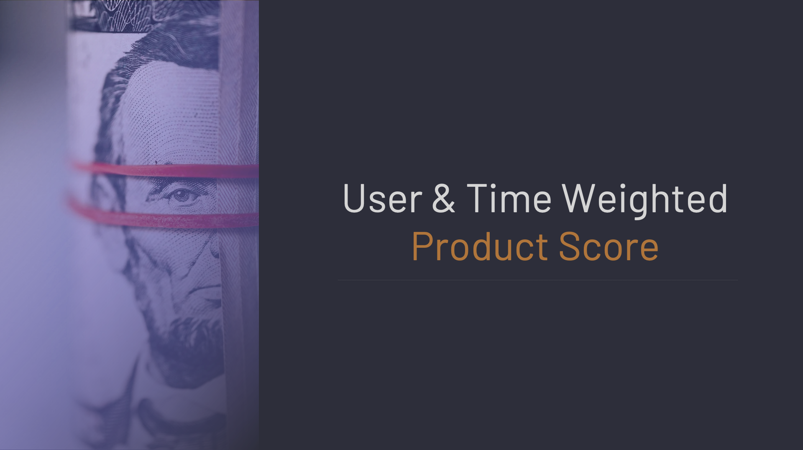

# Rating & Sorting Approaches


Think about the many complex concepts that analysts often encounter in how to create and evaluate quantitative metrics. 

In this repository, you can explore various approaches to measuring these concepts and get an overview of different levels of measurement and ways to transform variables. 

You can review the approaches and projects included in the repository below

Various projects related to rating and sorting and appropriate approaches to them are presented.

---

## [User & Time Weighted Product Score](01-rating-products/01-user-time-weighted-product-score.ipynb)

This project involves a study on how to calculate the most accurate score for a product by making various evaluations on the scores given to a product

---

## [Sorting Udemy Courses](02-product-sorting/02.1-sorting-udemy-courses/README.md)

Within the Data Science category, various Udemy courses are requested to be ranked.

In this case;

A ranking based on Rating, Comment and Purchase numbers as well as a ranking based on the average weight of these factors
Bayesian Average Rating (BAR Score)
Furthermore, at the end of the study, a hybrid solution of all these approaches and a ranking approach is discussed.

---

## [Sorting IMDB Movies](02-product-sorting/02.2-sorting-imdb-movies/README.md)

IMDB movies are intended to be ranked with various ranking approaches.

In this study;

A ranking based on Vote Count, Vote acerage numbers as well as a ranking based on the average weight of these factors

IMDB weighted average

Bayesian Average Rating (BAR Score)

furthermore, at the end of the study, a hybrid solution of all these approaches and a ranking approach is discussed.

---

## [Sorting Reviews](03-sorting-reviews/README.md)

There may be reviews as well as ratings about products. These reviews are one of the biggest factors influencing a person's purchasing decision.

Which review will we put at the top?

Our aim is to show the most helpful reviews, not the highest ones. The ranking here will be based on whether other users find the reviews helpful or not.

The following various sequencing approaches were considered within the project.

Up-Down Diff Score = (up ratings) − (down ratings)
Average Rating Score= (up ratings) / (all ratings)
Wilson Lower Bound Score

---

## [Rating Product & Sorting Amazon Reviews](04-amazon-rating-product-sorting-reviews/README.md)

One of the most important problems in e-commerce is the correct calculation of the points given to the products after the sale.

The solution to this problem means more customer satisfaction for the e-commerce site, product prominence for sellers and a smooth shopping experience for buyers.

Another problem is the correct ranking of the comments given to the products. Since the prominence of misleading reviews will directly affect the sales of the product, it will cause both financial loss and customer loss.

In solving these 2 basic problems, e-commerce sites and sellers will increase their sales while customers will complete their purchasing journey smoothly.


# Requirements

```
matplotlib==3.5.2
pandas==1.4.3
scipy==1.7.3
```

# **Files**

*[01-user-time-weighted-product-score.ipynb](https://github.com/oguzerdo/rating-sorting-approaches/blob/main/01-rating-products/01-user-time-weighted-product-score.ipynb) -* User & Time Weighted Product Score Calculation Notebook

*[02.1-sorting-udemy-courses.ipynb](https://github.com/oguzerdo/rating-sorting-approaches/blob/main/02-product-sorting/02.1-sorting-udemy-courses/2.1-sorting-udemy-courses.ipynb) -* Sorting Udemy Courses Notebook

*[02.2-sorting-imdb-movies.ipynb](https://github.com/oguzerdo/rating-sorting-approaches/blob/main/02-product-sorting/02.2-sorting-imdb-movies/2.2-sorting-imdb-movies.ipynb) -* Sorting IMDB Movies Notebook

*[03-sorting-reviews.ipynb](https://github.com/oguzerdo/rating-sorting-approaches/blob/main/03-sorting-reviews/03-sorting-reviews.ipynb) -* Sorting Reviews Notebook

*[04-amazon-rating-product-sorting-reviews.ipynb](https://github.com/oguzerdo/rating-sorting-approaches/blob/main/04-amazon-rating-product-sorting-reviews/04-amazon-rating-product-sorting-reviews.ipynb) -* Rating Product & Sorting Reviews in Amazon

# Author

[Oğuz Erdoğan](http://www.oguzerdogan.com)